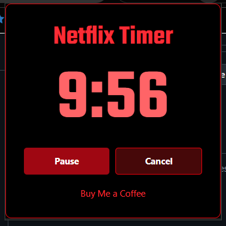
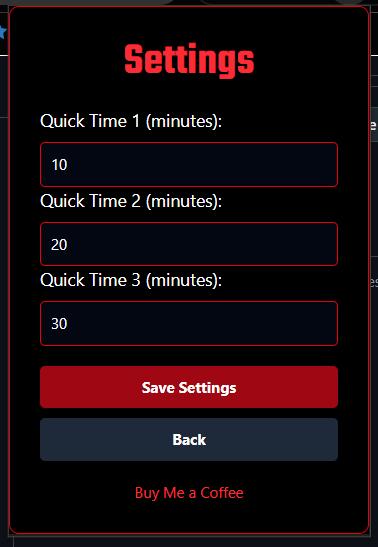

# Netflix Sleep Timer

Netflix Sleep Timer is a Chrome extension that automatically pauses Netflix (works also on YouTube, HBO, Apple TV+, ...) after a specified amount of time. This is useful for those who like to watch Netflix before bed and want to ensure that the video stops playing after they fall asleep.

You can install the extension directly from the [Chrome Web Store](https://chromewebstore.google.com/detail/netflix-sleep-timer/inkolgjoidkhgaangibkjdkfooebkgog).

## Screenshots

### Homepage / Main screen

User can set a timer using an input field or by pressing one of the quick select buttons. By pressing pause at the end of the video.

### Timer screen

Timer is set! Now user can pause or cancel it. When the timer is over, video from the active tab is paused.

### Settings

Here, you can customize the three quick select buttons from homepage

## Features

- Set a timer to automatically pause Netflix after a specified duration.
- Save quick timer settings for easy access.
- Pause, resume, or cancel the timer at any time.
- Simple and intuitive user interface.
- **New Feature:** You can now type numbers directly to set the timer and press Enter to start the timer without clicking on the input field.

## Installation

1. Clone the repository or download the ZIP file.
2. Open Chrome and navigate to `chrome://extensions/`.
3. Enable "Developer mode" in the top right corner.
4. Click on "Load unpacked" and select the directory where you cloned or extracted the repository.

## Usage

1. Open Netflix and start playing a video.
2. Click on the Netflix Sleep Timer extension icon in the Chrome toolbar.
3. Set the desired timer duration and click "Start Timer".
4. The video will automatically pause when the timer expires.

## Contributing

Contributions are welcome! Please open an issue or submit a pull request for any improvements or bug fixes.

## License

This project is licensed under the MIT License. See the [LICENSE](LICENSE) file for details.
